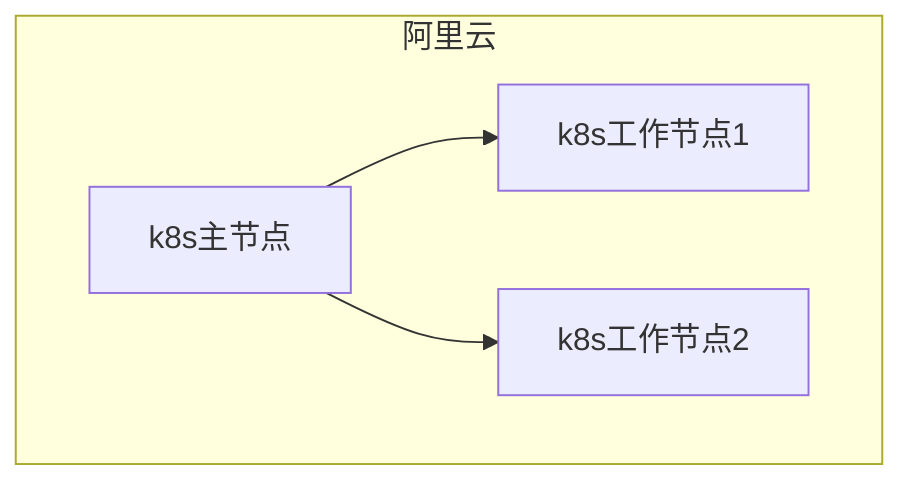
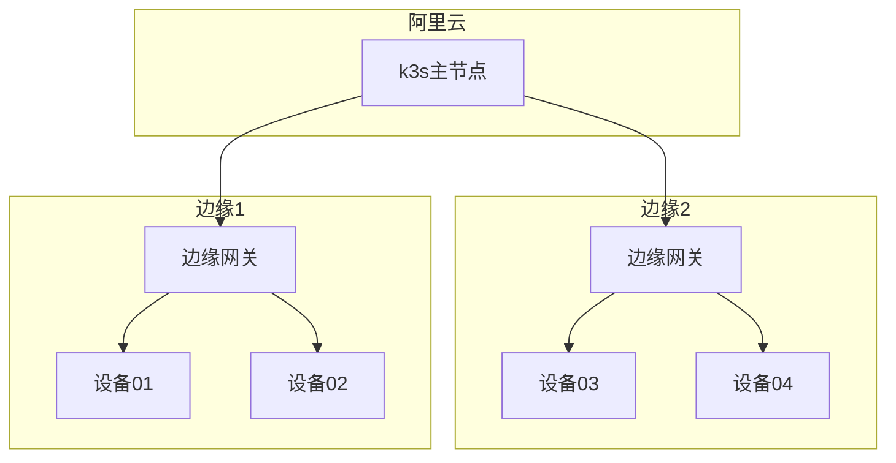
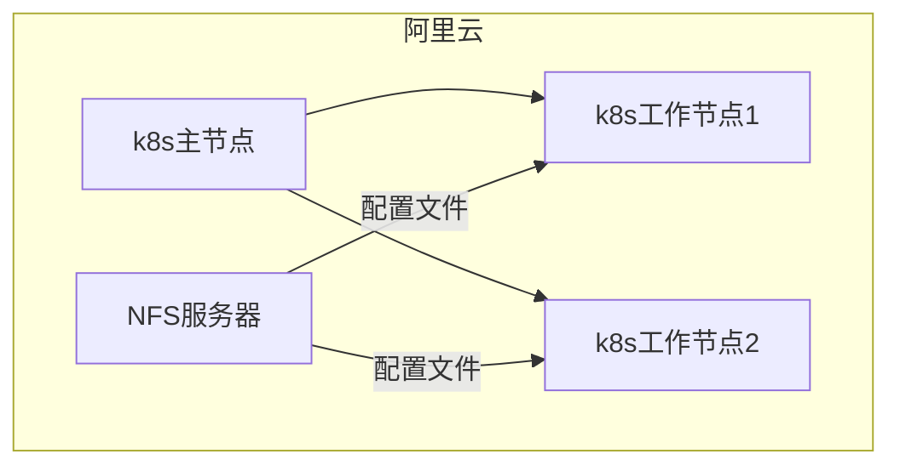
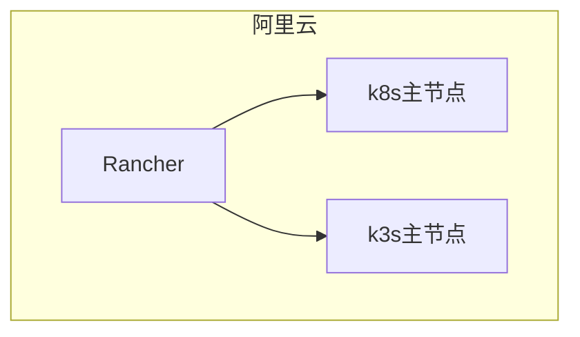
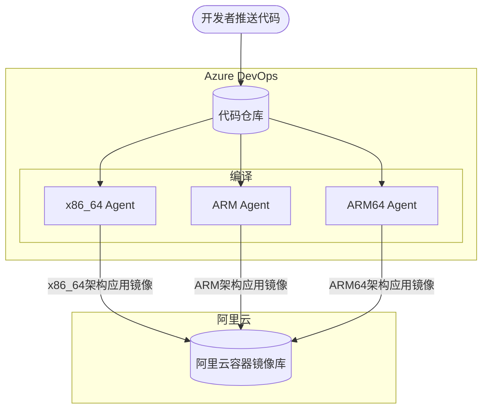
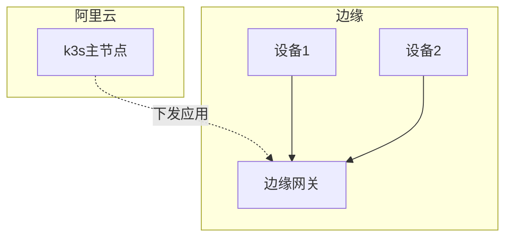
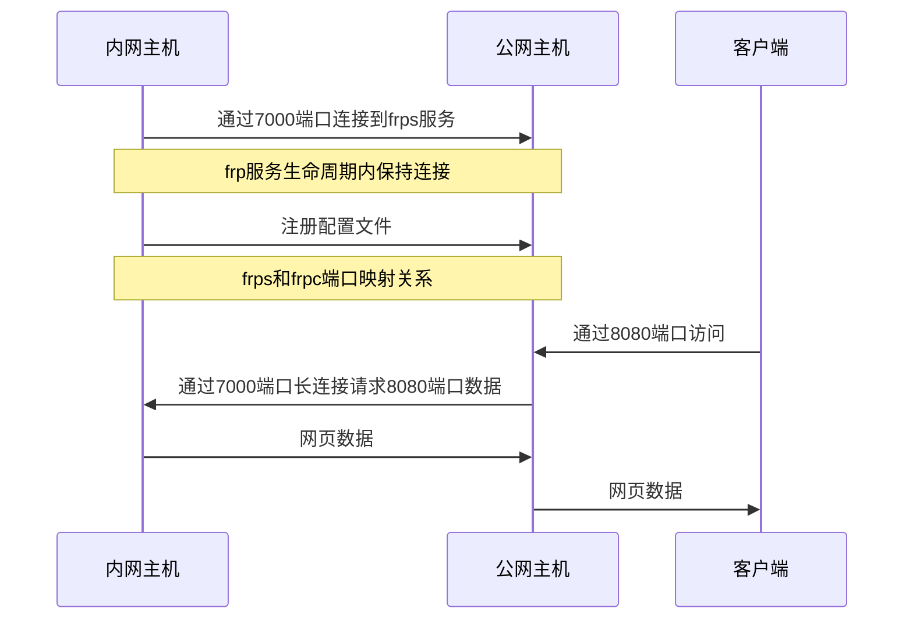
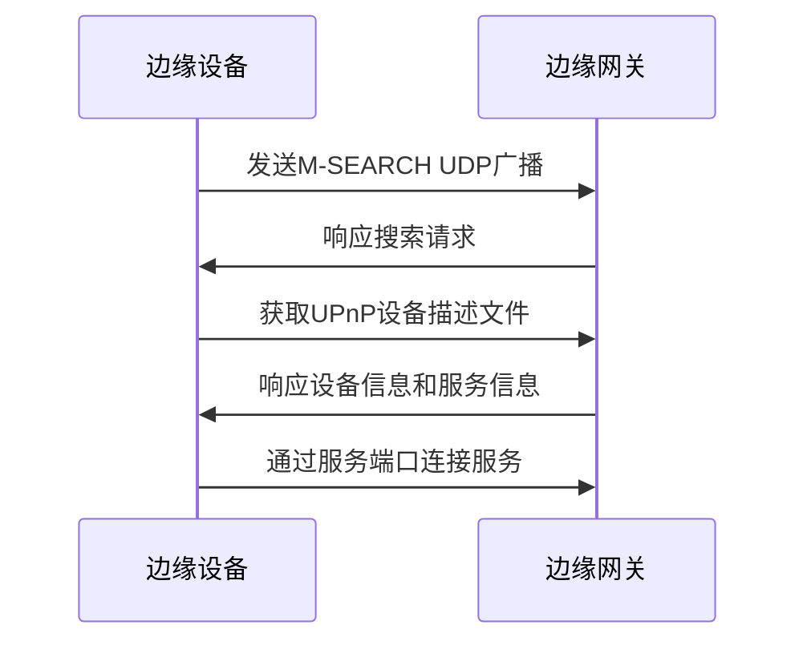
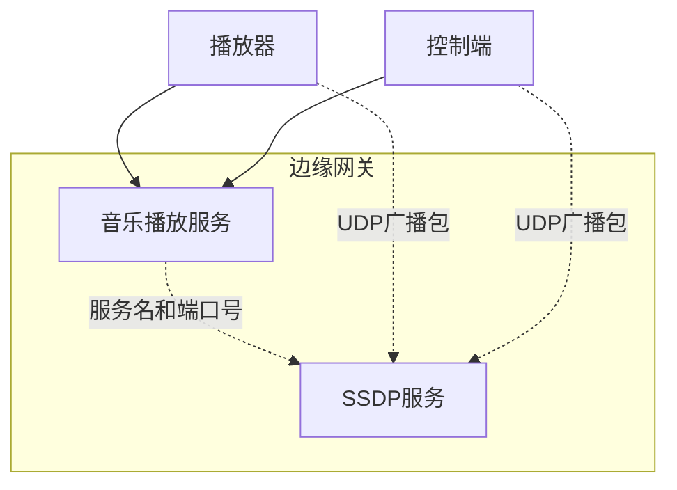

@[TOC]

## 1 引言

### 1.1 课题的研究背景和意义

到2020年，全球联网的设备已超过200亿台，随着IPv6主干网建设和5G移动网络的部署，将有更多的物联网设备之间连接到互联网。云端需要处理越来越多的边缘端设备数据，同时边缘端设备的安全性也面临着不小的挑战。

无人驾驶汽车的传感器和摄像头，实时捕捉路况信息，每秒大约会产生1GB的数据，如果无人驾驶判断依赖于云服务，不能保证服务的随时可用性和稳定性，而且还会给服务器造成不少的带宽压力。所以无人驾驶汽车这类产品需要能自身进行计算而不依赖于互联网。再以智能家居为例，越来越多的家庭设备依赖于云计算平台来进行控制，一旦网络出现故障，即使家里仍然有电，设备也不能很好的控制了。现在市场上几乎所有的智能音箱产品，只要脱离了互联网运行，就是电子废品，不管问什么问题，甚至是问个时间，都只会回答“请先连接到网络”。

边缘计算架构是将每个边缘节点设备赋予自主计算能力，简单来讲就是在边缘物联网传感器网络中加入一个高级网关，这个网关负责对传感器数据分析或存储，将部分信息、结果信息或报警信息上报到云服务。比如道路上的摄像头，边缘网关节点通过机器学习训练好的识别模型对摄像头画面进行汽车违规分析，假如识别到了违规情况和违规的车牌号，网关则会将这条违规信息上报到服务器。

本课题将云端的分布式服务架构整合到边缘计算架构中，并引入DevOps开发模型。将云端技术应用到边缘物联网设备中。同时能在边缘端支持横向拓展、应用隔离、服务发现、负载均衡、滚动升级。

### 1.2 国内外研究现状

#### 1.2.1 国内研究现状

KubeEdge是华为在2018年开源的面向边缘环境容器管理平台，KubeEdge能够接入云端Kubernetes集群，使得边缘应用的管理可以跟云端应用的管理一样，采用Kubernetes API。KubeEdge是一个开源系统，将本机容器化应用程序业务流程和设备管理扩展到边缘的主机。它基于 Kubernetes 构建，为云和边缘之间的网络、应用程序部署和元数据同步提供核心基础设施支持。它还支持 MQTT，并允许开发人员在 Edge 上编写自定义逻辑并启用资源受限的设备通信。


KubeEdge分为云端节点和边缘节点，云端节点依赖于Kubernetes集群，云端节点实现了一套Kubernetes API，将边缘节点与Kubernetes集群整合到一起管理。目前KubuEdge还处于初级开发版本，很多Kubernetes的基本组件还不支持（如：Persistent Volume、Ingress、Secret），这也给集群管理产生了很多麻烦。

#### 1.2.2 国外研究现状

K3S是Rancher出品的一个开源、简化、轻量Kubernetes，为物联网和边缘计算建立分布式的Kubernetes。支持ARM64和ARMv7架构，从很小的树莓派到AWS的a1.4xlarge 32GiB服务器都能运行。K3S只有一个不到40MB的可执行二进制文件，并且内置了容器引擎而不需要额外安装Docker，减少了安装、运行和更新Kubernetes集群所需的依赖性和步骤。


K3S移除了所有Beta版的API，与Kubernetes架构基本差别不大。master节点用了更轻便的SQLite代替了k8s的etcd数据库，边缘节点使用了内置的容器引擎来代替Docker CE引擎。还可以使用Flannel网络组件打通集群Pod之间的网络通讯。K3S除了可以在物联网边缘计算场景中使用，还可以在ARM服务器集群中运行分布式应用。

### 1.3 本课题的研究内容及章节安排

#### 1.3.1 课题研究的内容

通过查阅大量现有的边缘计算资料和书籍，结合多年来对云计算技术的学习和了解以及分析现有分布式边缘计算架构的特点和缺陷，通过云端K8S集群+边缘端K3S+边缘服务发现+DevOps自动化部署，实现了一套易管理、易扩展、易部署的分布式物联网边缘计算架构。

首先将分布式物联网边缘计算架构分为云-边-端三层。云端包括完整的Kubernetes集群、Azure DevOps Agent服务、Rancher集群管理服务、NFS服务、K3S Server。边缘端作为物联网边缘网关运行K3S Agent，边缘端与云端共享Config Map、Secert、Persistent Volume，并集成DDNS以更好的支持IPv6网络访问，集成frpc以穿透IPv4 NAT网络进行直接访问。设备端可以通过端口扫描、UDP广播、DNS等方式扫描局域网内的边缘节点，当前网络如果不存在边缘节点，设备端也可以直接连接到云端工作。

NFS服务器作为Kubernetes的一个Persistent Volume用来保存跨集群节点使用的持久化数据（如：配置文件、用户上传的文件等），Rancher集群管理服务可以同时管理云端的Kubernetes集群和边缘端的k3s集群，同时给Azure DevOps提供应用部署接口API。DDNS服务通过阿里云DNS解析API将所有边缘节点的IPv4和IPv6地址解析在域名`<边缘节点主机名>.zuozishi.online`上。frpc服务将边缘节点需要远程访问和管理的端口通过frp服务穿透到公网服务器，这样就能突破IPv4 NAT网络直接访问到边缘节点，这是一种IPv4到IPv6的过渡解决方案。

所有的云端、边缘端、设备端代码托管在Github和Azure DevOps Repos平台上，当本地代码推送到在线仓库时，触发Azure Pipelines自动化编译、测试、部署事件，将应用镜像推送到阿里云镜像库，通过应用部署配置文件将应用部署到云端、边缘端或设备端。云端、边缘端或设备端会根据配置文件从阿里云镜像库拉取镜像并运行。

云端、边缘端示例应用为网络音乐播放服务。网络音乐播放服务使用ASP .Net Core 3.1框架，实现用户使用酷狗账号登录、用户播放列表、音乐搜索、获取音乐歌词和URL等API接口，提供一个简单的Web访问界面，通过SignalR协议与设备端连接并通信。 设备端通过UDP广播包查询本地边缘节点，然后使用SignalR协议连接，实时报告音乐播放情况并接收控制指令。手机APP也在这个应用场景中作为设备端，一样通过UDP广播包查询本地边缘节点然后连接并通信。如果本地不存在边缘节点，音乐播放设备和手机APP将直接连到云端部署的应用进行工作。

#### 1.3.2 论文章节安排

本文章节安排如下：

第一章、引言。介绍分布式边缘计算的背景和意义，介绍国内外分布式边缘计算架构的发展和研究现状，介绍论文的主要研究内容和章节安排。

第二章、分布式边缘计算相关技术。介绍边缘计算和分布式的概念和特点，介绍虚拟化和容器技术的发展。

第三章、云端架构的分析与设计。阐述了分布式物联网边缘计算架构中服务端服务器的规划和重要服务的部署。

第四章、边缘端架构的分析与设计。阐述了分布式物联网边缘计算架构中边缘端的配置规划和重要服务。

第五章、应用的设计与实现。以音乐播放服务为例说明边缘网关和边缘设备以及云端的实际应用层设计。

第六章、系统关键代码及配置。列出了从云端、边缘网关到设备三方的关键代码和配置文件。

第七章、系统测试及改进。对云端、边缘网关和设备进行服务和功能测试，并针对现有不足做出改进方案。

## 2 分布式边缘计算相关技术

### 2.1 边缘计算的概念和特点

边缘计算采用一种分散式运算的架构，将之前由网络中心节点处理的应用程序、数据资料与服务的运算交由网络逻辑上的边缘节点处理。边缘计算将大型服务进行分解，切割成更小和更容易管理的部分，把原本完全由中心节点处理的大型服务分散到边缘节点。而边缘节点更接近用户终端装置，这一特点显著提高了数据处理速度与传送速度，进一步降低时延。

边缘计算作为云计算模型的扩展和延伸，直面目前集中式云计算模型的发展短板，具有缓解网络带宽压力、增强服务响应能力、保护隐私数据等特征。在智慧城市、智能制造、智能交通、智能家居、智能零售以及视频监控系统等领域，边缘计算都在扮演着先进的改革者形象，推动传统的“云到端”演进为“云-边-端”的新型计算架构。


### 2.2 虚拟化和容器技术

虚拟化是云计算的重要技术，可以将物理资源弹性地分配给客户。主机虚拟化的思想可以追溯到 IBM 机器的逻辑分区，即把一台 IBM 机器划分成若干台逻辑的服务器，每台逻辑服务器拥有独占的计算资源（CPU、内存、硬盘、网卡），可以单独安装和运行操作系统。IBM 机器价格昂贵，相对于当时的计算任务来说，机器的计算能力太过强大，所以需要划分为更小的计算单元。

后来随着个人计算机处理能力的不断发展，1998 年 VMware 公司成立，这家公司专注于机器虚拟化的软件解决方案。也就是说，对于不支持逻辑分区的计算机，可以直接通过安装 VMware 虚拟化软件来模拟更多的虚拟机，然后再在这些虚拟机里安装操作系统和应用软件，可以给虚拟机灵活配置内存、CPU、硬盘和网卡等资源。


但是在每台虚拟机里都要安装和运行操作系统的做法，仍然浪费了很多计算资源。为此，有公司专门推出了应用软件容器产品，即在操作系统层上创建一个个容器，这些容器共享下层的操作系统内核和硬件资源，但是每个容器可单独限制 CPU、内存、硬盘和网络带宽容量，并且拥有单独的 IP 地址和操作系统管理员账户，可以关闭和重启。与虚拟机最大的不同是，容器里不用再安装操作系统，因此浪费的计算资源也就大大减少了，这样同样一台计算机就可以服务于更多的租户。


### 2.3 分布式架构和Kubernetes

分布式系统是一个硬件或软件组件分布在不同的网络计算机上，彼此之间仅仅通过消息传递进行通信和协调的系统。

在3G移动网络发展初期，随着上网人数的飙升和人均上网带宽增加，单服务器应用已经不能满足需求，云计算开始发展,企业也开始将一个应用的不同组件放在多个服务器上来均衡流量和提高可用性。例如像淘宝这类的网站，要解决的重点问题就是海量商品搜索、下单、支付等问题; 像腾讯这类的网站，要解决的是数亿级别用户的实时消息传输;而像百度这类的公司所要解决的又是海量数据的搜索。每一个种类的业务都有自己不同的系统架构。


Kubernetes 是用于自动部署，扩展和管理容器化应用程序的开源系统。它将组成应用程序的容器组合成逻辑单元，以便于管理和服务发现。Kubernetes 源自Google 15 年生产环境的运维经验，同时凝聚了社区的最佳创意和实践。Google 每周运行数十亿个容器，Kubernetes 基于与之相同的原则来设计，能够在不扩张运维团队的情况下进行规模扩展。Kubernetes 是开源系统，可以自由地部署在企业内部，私有云、混合云或公有云。

Kubernetes是一个全新的的分布式架构领先方案，它基于容器技术，目的是实现资源管理的自动化，以及多个数据中心的资源利用率的最大化。通常，我们会把Kubernetes看作Docker的上层架构，就好像Java与J2EE的关系一样：J2EE是以Java为基础的企业级软件架构，Kubernetes则以Docker为基础打造了一个云计算时代的全新分布式系统架构。

> Kubernetes并不是依赖于Docker，也可以支持其他的容器引擎，如：Rocket、lxd 、rkt。

## 3 云端架构的分析与设计

### 3.1 云端基础架构配置和规划

云端服务器使用了五台阿里云的ECS（Elastic Compute Service）学生免费版入门级服务器，详细配置如下：

* CPU：2核

* 内存：4GiB

* 操作系统：CentOS 7.7 64位

* 独立公网IP

* 公网带宽：1Mbps

* 系统盘：40GiB (2120 IOPS)

* 地域：阿里云-华北2（北京）

> 注：由于个人能力，实验集群只在阿里云北京区域中搭建，如果跨不同地区搭建集群，则可以实现多地负载均衡，不过需要收取跨地区通信的流量费。

由于五台机器属于不同的阿里云账号下，所以这五台机器不属于一个局域网，需要先在阿里云平台配置跨账号的云企业网，配置云企业网的实质则是配置这五个机器内网网段的路由表，配置完成后则认为这五台机器通过这个路由表进行跨网段通信。


其中一台机器作为master节点，两台机器作为node工作节点，一台服务器用来部署NFS文件共享服务、Azure Pipelines Agent和Rancher集群管理服务，一台作为k3s的master节点。

| 主机名             | 内网IP           | 外网IP           | 角色                |
| --------------- | -------------- | -------------- | ----------------- |
| Zuozishi-Master | 172.17.151.242 | 39.107.139.105 | k8s master        |
| Zuozishi-Slave1 | 172.17.57.231  | 39.97.161.176  | k8s工作节点           |
| Zuozishi-Slave2 | 172.17.77.128  | 47.93.236.68   | k8s工作节点           |
| Aliyun-YXM      | 172.17.196.228 | 39.97.114.49   | k3s master、frps服务 |
| Aliyun-TXR      | 172.17.81.0    | 47.94.90.203   | NFS服务、集群管理者       |

考虑到外部连接集群和应用的安全性，尽量使用了HTTPS协议，所以先要为主机申请SSL证书，本项目使用在阿里云申请的一年有效期的免费SSL证书。


### 3.2 Kubernetes集群配置



修改需要安装Kubernetes所有主机的Hosts：

```bash
echo > /etc/hosts < EOF
::1 localhost
127.0.0.1 localhost
172.17.57.231   Zuozishi-Slave1
172.17.77.128   Zuozishi-Slave2
172.17.196.228  Zuozishi-Slave3
172.17.81.0     Aliyun-TXR      Zuozishi-NFS
172.17.151.242  Zuozishi-Master
172.17.151.242  Zuozishi-Master Zuozishi-Master
EOF
```

在master节点运行自己编写的一键配置/安装脚本，脚本大概过程如下：

1. 关闭防火墙

2. 配置软件安装源（yum）为阿里云镜像源

3. 安装相关工具（wget、net-tools、sshpass）、docker-ce（容器运行引擎）、docker-ce-cli（容器引擎命令行管理工具）、kubelet（k8s核心）、kubeadm（k8s部署工具）、kubectl（k8s命令行管理工具）

4. 下载Kubernetes所依赖的Docker镜像

5. 配置Kubernetes容器内网络（安装weave网络插件）

6. 安装kubernetes-dashboard（Web管理工具）

7. 配置用于远程访问的SSL证书

工作节点配置与master前4个步骤相同，最后运行kubeadm join命令将该主机向master注册为工作节点即可。

### 3.3 K3S集群配置



k3s相比k8s的安装简单不少，只需要运行几句命令：

```bash
# master节点
curl -sfL https://get.k3s.io | sh -

# 安装Web管理工具
GITHUB_URL=https://github.com/kubernetes/dashboard/releases
VERSION_KUBE_DASHBOARD=$(curl -w '%{url_effective}' -I -L -s -S ${GITHUB_URL}/latest -o /dev/null | sed -e 's|.*/||')
k3s kubectl create -f https://raw.githubusercontent.com/kubernetes/dashboard/${VERSION_KUBE_DASHBOARD}/aio/deploy/recommended.yaml

# 编译节点
export K3S_URL=39.97.114.49
export K3S_TOKEN=<密钥>
curl -sfL https://get.k3s.io | sh -
```

### 3.4 NFS服务器配置

NFS 即网络文件系统（Network File System），可以通过网络让不同机器、不同系统之间可以实现文件共享。在该项目中，NFS服务负责保存集群应用中所需的配置文件和一致性文件（即在集群环境中，多台机器访问同一份文件）。通过Kubernets的Persistent Volume（持久卷），将NFS挂载到容器内，多个容器就能访问到同一份文件。



NFS服务器配置如下：

1. 安装 NFS 软件包`yum install -y nfs-common nfs-utils rpcbind`

2. 添加 NFS 共享目录
   
   将`/nfsroot`目录设置为NFS共享目录，设置改目录的权限为最宽松的权限`chmod 777 /nfsroot`

3. 启动NFS服务`/etc/init.d/nfs-kernel-server start`

### 3.5 多集群管理服务配置

多集群管理服务Rancher可以在一个Web应用中管理多个k8s或k3s集群，并通过提供的API接口来通过微软云DevOps远程管理集群和部署应用。



本项目的Rancher服务安装在独立于k8s集群的服务器中，运行在Docker容器中，使用`devops.zuozishi.info`域名的HTTPS证书，暴露6443端口访问。安装命令如下：

```bash
docker run -d --restart=unless-stopped \
  -p 6443:443 \
  -v <FULL_CHAIN.pem>:/etc/rancher/ssl/cert.pem \
  -v <PRIVATE_KEY.pem>:/etc/rancher/ssl/key.pem \
  -v <CA_CERTS.pem>:/etc/rancher/ssl/cacerts.pem \
  rancher/rancher:latest
```

> 由于域名未经备案，80端口和443端口无法使用。

安装完成后通过地址`https://devops.zuozishi.info:6443`访问管理页面，设置初始密码。然后将k8s和k3s集群加入到管理中心。最后再新建一个远程访问API的密钥，用于远程部署应用。

### 3.6 Azure DevOps Agent配置

在云端架构中，采用了混合云模式。基础服务和应用运行在阿里云ECS中，可执行文件以容器的方式保存在阿里云容器镜像服务中。而代码和自动化测试编译由微软云DevOps负责。在测试编译环节中，代码需要编译成多架构版本的（包括x86_64和arm、arm64）可执行文件，同时满足在云端环境（x64）和边缘环境（arm或arm64）运行。所以当代码push到仓库时，Azure DevOps会分别在x64和arm架构服务器中编译代码，这里负责编译代码的服务器就称之为Azure DevOps Agent。Azure DevOps中会给账号分配一个免费的agent（x64架构），因为应用要在编译节点树莓派（arm架构）中运行，需要配置一台arm架构的agent服务器负责编译代码生成arm架构的可执行程序。值得一提的是，在2020年前后，arm在服务器市场越来越有优势。



Azure DevOps Agent服务配置过程如下：

1. 登录Azure DevOps平台

2. 在个人中心页面中创建一个API Key用于agent用户认证

3. 下载arm版本的agent服务程序

4. 运行./config.sh，配置API Key

5. 运行agent服务


## 4 边缘端架构的分析与设计

### 4.1 边缘端基础架构配置和规划

边缘端包括边缘网关和设备，边缘网关主要负责连接设备并接收和处理设备发送的数据。边缘网关作为k3s工作节点，可以通过k3s主节点进行管理，边缘应用通过k3s主节点进行下发，以容器方式运行在边缘网关，应用下发后，即使边缘网关失去了对主节点的连接，也不会影响现有应用的运行，但是无法及时对应用进行更新。



在本项目中，使用虚拟机作为边缘网关，使用iTop-4413 ARM9开发板和树莓派4B作为边缘设备。

虚拟机的主要参数如下：

* CPU：2核

* 内存：4GiB

* 操作系统：Ubuntu 20.04 64位

* 系统盘：50GiB

* IPv6支持

树莓派4B的主要参数如下：

* SOC：Boradcom BCM2711

* CPU：64位 1.5GHz 四核（28nm工艺）

* 内存：4GB LPDDR4

* GPU：Boradcom VideoCore VI @ 500MHz

* 供电接口：Type-C（5V 3A）

* WiFi网络：802.11AC 无线 2.4GHz/5GHz 双频

* 有线网络：真千兆以太网

* 操作系统：Raspbian Buster with desktop（32位系统）

iTop-4412开发板主要参数如下：

* CPU：Exynos4412，四核Cortex-A9，主频为1.4GHz-1.6GHz

* 内存：2GB 双通道 DDR3

* 供电接口：5V/2A

* 有线网络：10M/100M自适应网口

* I/O接口：耳机输出、MIC输入、2路串口、1路A/D、摄像头接口、WiFi接口、HDMI输出、2路USB Host、1路USB OTG、GPIO（20PIN）、LCD接口（2个LVDS接口、1个RGB接口）、MIPI接口、GPS接口、JTAG接口

* 操作系统：Android 4.4（API Level 19）

### 4.2 Aliyun-DDNS服务设计

Aliyun-DDNS负责把边缘网关的外部IPv4和IPv6地址通过阿里云DNS解析服务解析到域名`<边缘网关主机名>.zuozishi.online`，如果边缘网关使用公网IP或支持IPv6网络，则可以通过解析的域名直接能远程访问到边缘网关，方便管理。

### 4.3 frp服务设计

frps服务主要针对于IPv4的NAT网络和非IPv6网络环境中，是对边缘网关进行远程访问的一种额外手段，通过端口转发方式，将处于内网的边缘网关通过frp服务将边缘网关的某个端口映射到具有公网IP主机的某个端口上。



> frps：指frp server（frp服务端，公网主机）
> frpc：指frp client（frp客户端，内网主机）

### 4.4 服务发现（SSDP）

边缘物联网设备通过服务发现来找到局域网中可以连接的边缘网关，服务发现使用简单服务发现协议（SSDP，Simple Service Discovery Protocol）实现。边缘网关通过SSDP协议在网络中注册为UPnP边缘网关设备，通过Kubernetes API（边缘网关为k3s，但是API是兼容的）将可用的边缘应用作为UPnP属性。物联网设备端扫描网络中可用的UPnP设备，通过UPnP设备属性判断局域网中有没有可用的边缘网关,然后通过SSDP协议中的xml链接获取UPnP设备描述文件，设备描述文件包括边缘网关中运行的服务和服务端口号，然后设备端进行连接。

> 简单服务发现协议（SSDP）是一种应用层协议，是构成通用即插即用(UPnP)技术的核心协议之一。简单服务发现协议提供了在局部网络里面发现设备的机制。



边缘网关SSDP服务使用JavaScript语言开发，运行在NodeJS环境，使用express组件提供HTTP协议服务。
主要代码如下：

```JavaScript
// 注册为UPnP设备
server.addUSN('upnp:rootdevice')
// 注册为边缘网关
server.addUSN('urn:schemas-upnp-org:device:EdgeGateway:1')
// 注册k3s-nodePort类型服务发现服务
server.addUSN('urn:schemas-upnp-org:service:k3s-nodePort-Service:1')
// 启动SSDP服务
server.start()
    .catch(e => {
        console.log('SSDP服务启动失败:', e)
    })
    .then(() => {
        console.log('SSDP服务已启动')
    })

// 注册UPnP设备描述文件访问路径
app.get('/device.xml', (req, res) => {
    res.contentType('text/xml')
    // 从文件中读取
    var xml = fs.readFileSync('./device.xml', 'utf8').toString()
    // 替换主机名
    xml = xml.replace('{hostname}', os.hostname()).replace('{hostname}', os.hostname())
    // HTTP请求返回数据
    res.send(xml)
})

// 注册k3s服务发现访问路径
app.get('/service', (req, res) => { 
    res.contentType('application/json')
    var services = []
    // 通过Rancher API查询k3s服务
    rp({
        uri: 'https://devops.zuozishi.info:6443/v3/project/c-cx29q:p-2hlhh/services/',
        headers: {
            'Authorization': 'Bearer <token>'
        },
        json: true
    }).then((obj) => {
        if ('data' in obj) {
            // 遍历所有服务
            obj['data'].forEach(item => {
                // 找到类型为NodePort的服务
                if (item['kind'] == 'NodePort' && 'publicEndpoints' in item) {
                    item['publicEndpoints'].forEach(endpoint => {
                        var service = endpoint
                        service['name'] = item['name']
                        service['namespace'] = item['namespaceId']
                        services.push(service)
                    })
                }
            });
        }
        // HTTP请求返回数据
        res.send(services)
    }).catch((e) => {
        // HTTP请求返回数据
        res.send(services)
    })
})
```

## 5. 应用的设计与实现

### 5.1 音乐播放服务

#### 5.1.1 概述

音乐播放服务运行在边缘端，提供用户登录、实时控制、播放列表、网络资源搜索等功能。基于ASP Net Core框架，使用Visual Studio IDE进行开发，开发语言：C#。

> .NET Core是一个能在Windows、Linux、macOS平台上运行Web服务和命令行应用的跨平台的.NET框架。

音乐播放服务主要使用了ASP Net Core的三大模块：API Controller、Razor Pages、SignalR Hub。

* API Controller: 提供音乐搜索、用户登录、播放列表等RESTful API
* Razor Pages: 提供网页页面、渲染页面
* SignalR Hub: 提供播放器和播放控制端的实时通信通道（实现实时控制和日志上报）

#### 5.1.2 RESTful API设计

RESTFUL是一种网络应用程序的设计风格和开发方式，基于HTTP，可以使用XML格式定义或JSON格式定义（项目中使用JSON格式）。API分为登录、在线资源、播放列表大三类别，服务使用酷狗用户认证。

1. 登录相关：

方法 | 路径 | 功能 | 请求参数
-- | -- | -- | --
PSOT | api/login/update | 更新用户Cookie | Cookie（body）
GET | api/login/check | 检测用户Cookie是否有效 | Cookie（header）
   
2. 在线资源相关：
   
方法 | 路径 | 功能 | 请求参数
-- | -- | -- | --
GET | api/presearch/{keyword} | 获取预搜索结果 | keyword-关键词
GET | api/search/{keyword} | 搜索网络资源 | keyword-关键词
GET | api/search/{keyword}/source | 搜索并返回第一个播放源 | keyword-关键词
GET | api/song/{hash} | 获取歌曲信息 | hash-歌曲哈希值
GET | api/mv/{hash} | 获取MV信息 | hash-MV哈希值
GET | api/mv/{hash}/source} | 获取MV播放源 | hash-MV哈希值
GET | api/lrc/{keyword}/{duration} | 获取歌词 | hash-歌曲哈希值<br />duration-歌曲总时长

3. 播放列表相关：

方法 | 路径 | 功能 | 请求参数
-- | -- | -- | -- 
GET | playlist/isfav/{mid} | 判断是否是喜欢的音乐 | mid-音乐ID
GET | api/playlist/fav | 获取喜欢的音乐列表 | keyword-关键词
POST | api/playlist/fav | 将歌曲添加到喜欢的音乐 | 歌曲JSON数据（body）
DELETE | api/playlist/fav/{mid} | 将歌曲从喜欢的音乐列表中移除 | mid-音乐ID
GET | api/playlist/all | 获取全部播放列表 | 
POST | api/playlist/song/{id} | 将歌曲添加到播放列表 | 歌曲JSON数据（body）
DELETE | api/playlist/song/{id}/{mid} | 将歌曲从播放乐列表中移除 | id-播放列表ID<br />mid-音乐ID
GET | api/playlist/isin/{id}/{mid} | 判断音乐是否在播放列表中 | id-播放列表ID<br />mid-音乐ID

#### 5.1.3 SignalR消息定义

ASP.NET Core SignalR是一种开放源代码库，可简化将实时 web 功能添加到应用程序的功能。 实时 web 功能使服务器端代码可以立即将内容推送到客户端。SignalR会自动选择服务器和客户端功能内的最佳传输方法，包括：WebSocket、服务器发送的事件、长轮询。

SignalR使用“中心”在客户端和服务器之间进行通信。“中心”是一种高级管道，它允许客户端和服务器分别调用方法。 SignalR自动处理跨计算机边界的调度，使客户端能够在服务器上调用方法，反之亦然。 可以将强类型参数传递给方法，从而启用模型绑定。 SignalR提供了两个内置的集线器协议：基于 JSON 的文本协议和基于MessagePack的二进制协议。 与 JSON 相比，MessagePack 通常会创建较小的消息。

音乐播放服务的SignalR“中心”接口定义如下表：

| 函数名                 | 参数            | 功能        |
|:-------------------:|:-------------:|:---------:|
| WriteLog            | 日志类别, 消息      | 上报日志      |
| RegisterPlayer      | 播放器ID         | 注册为播放器    |
| RegisterClient      | 客户端ID,客户端群组ID | 注册为客户端    |
| PropertyChanged     | JSON数据        | 播放器数据变动   |
| RequireData         | 无             | 请求播放器重发数据 |
| PlayListChanged     | 播放列表ID        | 播放列表变动    |
| EnumPlayers         | 无             | 枚举播放器     |
| EnumPlayersCallback | 播放器ID         | 枚举播放器回调   |
| SearchAndPlay       | 关键词           | 搜索并播放     |
| MediaCtrl           | 类别,数据         | 媒体控制      |

无论任何语言和任何平台，只要播放端和控制端满足上述接口定义，就能实现远程音乐播放器控制。

#### 5.1.4 网页页面设计

服务提供两个页面，主页和API文档。主页可以对连接到服务的播放器进行控制，支持歌词/进度显示、搜索并播放、播放列表控制、上一曲、下一曲、播放/暂停、音量控制。服务端使用使用Razor渲染页面，页面使用bootstrap作为UI框架，使用VUE.js进行数据绑定，使用SignalR Client库与SignalR“中心”连接。API文档由Swagger自动从代码生成API文档页面。

#### 5.1.5 容器化服务

使用Docker和Dockerfile文件将程序编译，并打包成镜像。Dockerfile打包过程如下：

1. 使用dotnet/core/aspnet:3.0-buster-slim作为基准镜像
2. 使用dotnet/core/sdk:3.0-buster作为编译环境镜像
3. 设定工作目录为/app
4. 拷贝代码到容器中
5. 下载程序所依赖的第三方库
6. 编译
7. 将基准镜像作为最终运行镜像
8. 保留服务端口：81
9. 复制编译后的dll到当前文件夹
10. 设置容器入口命令：dotnet MusicCloud.dll

#### 5.1.6 Kubernetes服务定义

项目中的`kubernetes.k8s.yaml`文件定义了音乐播放服务在Kubernets集群中的注册信息。`kubernetes.k3s.yaml`文件定义了音乐播放服务在k3s集群中的注册信息。
在k8s集群中，使用Deployment调度3个容器运行服务，将NFS PVC映射到容器中`/nfs-pvc`路径，使用阿里云镜像密钥从阿里云镜像库拉取镜像，注册一个服务，将宿主机的30005端口映射到容器的81端口。
在k3s集群中，使用DaemonSet在每个编译节点都调度一个音乐播放服务，使用阿里云镜像密钥从阿里云镜像库拉取镜像，注册一个服务，将宿主机的30005端口映射到容器的81端口。

#### 5.1.7 自动化编译/部署

项目中的`azure-pipelines.yml`文件定义了项目代码提交到远程代码库时，触发Azure Pielines运行时所需要执行的编译/部署步骤。

1. 编译镜像
2. 将镜像推送到阿里云容器镜像库
3. 配置Kubernetes应用部署文件
4. 上传应用部署文件
5. 部署应用

### 5.2 音乐播放器和音乐控制端

#### 5.2.1 概述

音乐播放器和音乐控制端基于谷歌Flutter框架，使用Dart语言，以Visual Studio Code作为IDE进行开发。音乐播放器运行在Android 4.4系统的ARM开发板上，可以连接外设，音乐控制端支持Android和iOS。

> Flutter是谷歌的移动UI框架，可以快速在iOS和Android上构建高质量的原生用户界面。

音乐播放器和音乐控制端使用同一套源码，通过获取设备信息来判断加载播放器UI还是加载控制端UI。音乐播放器和音乐控制端都通过简单服务发现协议（SSDP）搜索局域网中可以连接的边缘网关，连接到音乐播放服务的SignalR“中心”，分别注册为播放器和客户端。播放器接收客户端的控制指令，并上报音乐播放状态和播放列表。控制端向播放端发送控制指令，并接收音乐播放状态和播放列表。播放器使用酷狗客户端扫描二维码方式登录账号，通过API进行资源搜索、访问/修改播放列表、更新Cookie。



#### 5.2.2 播放器UI设计

播放器端包含四个页面：二维码登录页面、播放主页面、播放列表页面、推荐页面。
播放主页面的元素包括：图片背景、播放时会旋转的专辑封面、上一曲/下一曲/播放/暂停控制按钮、收藏按钮、播放进度时间文本、歌曲名/歌手标签、音量控制条、两行歌词文本。播放列表页面显示用户所有的播放列表和当前正在播放的列表。推荐页面根据当前正在播放的音乐显示推荐的更多音乐和歌单。

#### 5.2.3 播放器程序逻辑

程序开始运行时，首先通过SSDP协议扫描局域网中的边缘网关，然后通过SignalR协议连接边缘网关中运行的音乐播放服务，通过SignalR协议调用“中心”的RegisterPlayer方法将当前连接注册为播放器。通过HTTP调用`api/login/check` API判断用户是否已经登录，如果没有登录则显示二维码登录页面，如果用户已经登录则显示播放器主页。播放器注册SignalR“中心”MediaCtrl方法，监听控制端的数据。当音乐播放状态改变时，调用SignalR“中心”的PropertyChanged（播放器数据变动）、PlayListChanged（播放列表变动）方法向控制端上报最新数据。

#### 5.2.4 控制端UI设计

控制端有多个页面，主要的有：播放主页面、播放列表、推荐页面、乐库、每日歌曲推荐、排行榜、搜索和搜索结果页面。

* 播放主页面：显示当前音乐播放状态（进度、歌词）、音乐控制（上一曲/下一曲/播放/暂停）。
* 播放列表：显示当前播放列表，支持删除、另存为播放列表。
* 推荐页面：通过调用酷狗API，基于当前播放的音乐推荐其他音乐和歌单。
* 每日歌曲推荐：通过调用酷狗API，根据用户习惯推荐音乐。
* 搜索和搜索结果页面:通过调用酷狗API，搜索网络音乐，选择可以立即播放或添加到播放列表。

#### 5.2.5 控制端程序逻辑

程序开始运行时，首先通过SSDP协议扫描局域网中的边缘网关，然后通过SignalR协议连接边缘网关中运行的音乐播放服务，通过SignalR协议调用“中心”的RegisterClient方法将当前连接注册为音乐控制器。程序注册SignalR“中心”的PropertyChanged方法监听播放器上报的音乐播放状态。用户操作时，调用MediaCtrl方法控制播放器。

### 5.3 基于树莓派的音乐控制器

#### 5.3.1 概述

在本项目应用示例中，任何设备只需要先通过简单服务发现协议查找到边缘网关的服务入口，然后通过SignalR协议连接到音乐播放服务，注册为播放器或客户端（控制器）就能根据特定规则（SingalR“中心”方法）完成特定的功能。
基于树莓派的音乐控制器通过GPIO按钮实现控制播放器上一曲/下一曲/播放/暂停，通过LCD 20*4显示屏显示音乐播放状态（播放器名、音量、当前歌曲剩余时间、播放进度条、边缘网关IP），通过RFID读卡器导入/导出播放列表，通过IR红外接收器使用遥控器和小爱同学控制音乐播放。

#### 5.3.2 硬件设计

硬件清单：

名称 | 数量
-- | --
树莓派 4B | 1
树莓派接口扩展器 | 1
RC522 RFID读卡器 | 1
GPIO按钮 | 4
I2C LCD2004 液晶显示屏 | 1
IR红外解码/编码模块 | 1
USB-TTL（USB转串行口） | 1
蓝色LED灯 | 1
100 kΩ电阻 | 1

硬件接线图：


重要外设介绍：

* RFID-RC522 RFID读卡器
RC522模块是基于射频基站芯片的Mifare卡读写模块，模块工作再13.56MHz频率，可支持Mifare 1S50、Mifare 1S70、Mifare Light、Mifare Ultralight、Mifare Pro。模块具有易用、高可靠、体积小等特点，可以帮助客户方便、快捷的将非接触卡应用到系统中.

* I2C LCD2004 液晶显示屏
众所周知，LCD液晶显示屏虽然极大地丰富了人机交互，但他们有一个共同的弱点。当它们连接到主控制器时，会占用主控制器的多个IO接口，同时也限制了主控制器的其他功能。因此，通常利用PCF8574系列芯片通过IIC总线扩展多个IO接口来驱动LCD显示屏。IIC总线是由PHLIPS发明的一种串行总线。它是一种高性能串行总线，具有多主机系统所要求的总线控制和高速或低速设备同步功能。IIC总线只有两个双向信号线，串行数据线(SDA)和串行时钟线(SCL)。I2C LCD2004上的蓝色电位计用于调整背光，使其更易于在I2C LCD2004上显示。


#### 5.3.3 软件设计

软件运行环境基于.Net Core，.Net Core可用于为物联网设备和场景构建应用程序，物联网应用通常与需要使用GPIO引脚、串口或类似硬件的传感器、显示器和输入设备进行交互。`System.Device.Gpio`命名空间中包含了对 硬件底层的访问（GPIO、SPI、IIC、Serial），` Iot.Device.Bindings`命名空间包含了硬件的绑定（具体的外设），由社区开发者维护。
使用Visual Studio Code作为IDE进行开发，结合vscode的SFTP插件，通过SFTP协议，代码变动时自动将代码上传到树莓派。`dotnet watch run`命令可以监测代码文件的变动，代码变动时自动重新编译运行。

重要类(class)设计：

| 构造函数                              | 说明                                    | 参数                                |
| --------------------------------- | ------------------------------------- | --------------------------------- |
| GpioButton(int pin)               | 表示一个GPIO按钮，提供按钮按下的事件                  | pin - 引脚编号                        |
| GpioLed(int pin)                  | 表示一个LED灯，提供开(On)灯、关灯(Off)方法           | pin - 引脚编号                        |
| IR(string portName, int baudRate) | 表示一个红外接收器，提供收到红外信号的事件                 | portName - 串行口设备地址，baudRate - 波特率 |
| LCD2004(int address)              | 表示LCD屏幕，提供清屏/输出/显示进度条方法               | address - IIC设备地址                 |
| Mfrc522Lib()                      | 表示RFID读卡器，提供读卡ID事件                    |                                   |
| MusicServerDiscover()             | 通过SSDP协议扫描边缘网关，提供音乐服务连接入口             |                                   |
| RemotePlayer(string url)          | 表示远程播放器，提供控制设备方法(MediaCtrl)和播放器属性变动事件 | url-音乐服务连接入口                      |
| PlayerReportProperty()            | 表示音乐播放器属性（包括：当前播放列表、音量、播放进度、歌词等）      |                                   |

程序工作流程：

1. 初始化硬件（GPIO、LCD、红外接收器、RFID读卡器）
2. 扫描边缘网关
3. 获取音乐服务入口
4. 连接到SignalR“中心”
5. 注册为客户端
6. 注册播放器属性变动事件
7. 主线程延时死循环

初始化主要代码：

```csharp
static GpioController controller;
static GpioLed led;
static Mfrc522 rfid;
static GpioButton btn1;
static GpioButton btn2;
static GpioButton btn3;
static GpioButton btn4;
static IR ir;
static LCD2004 lcd;
static RemotePlayer player;
static PlayerReportProperty playerProperty;
static string rfidMode = "";

static void Main(string[] args)
{
  playerProperty = new PlayerReportProperty();
  try
  {
    controller = new GpioController();
    Console.WriteLine("初始化LED...");
    led = new GpioLed(controller, 26);
    led.Off();
    Console.WriteLine("初始化GPIO按键...");
    btn1 = new GpioButton(controller, 12);
    btn1.ButtonPressed += ButtonPressed;
    btn2 = new GpioButton(controller, 16);
    btn2.ButtonPressed += ButtonPressed;
    btn3 = new GpioButton(controller, 20);
    btn3.ButtonPressed += ButtonPressed;
    btn4 = new GpioButton(controller, 21);
    btn4.ButtonPressed += ButtonPressed;
    Console.WriteLine("初始化LCD...");
    lcd = new LCD2004(0x27);
    lcd.WriteLine(0, "Cloud Player");
    lcd.WriteLine(3, "Wait to find server");
    Console.WriteLine("初始化RFID读卡器...");
    rfid = new Mfrc522();
    rfid.InitIO(controller).Wait();
    rfid.StartFound();
    rfid.CardFound += FoundRfidCard;
    Console.WriteLine("初始化红外接收器...");
    ir = new IR("/dev/ttyUSB0", 9600);
    ir.IR_Received += IR_Received;
  }
  catch (Exception e)
  {
    Console.WriteLine(e.Message);
    Console.WriteLine("非树莓派运行!!!");
  }
  Console.WriteLine("初始化完成，等待连接服务器。");
  player = new RemotePlayer();
  // 播放器连接事件
  player.PlayerConnectEvent += (id) =>
  {
    if (id == null)
    {
      led?.Off();
      lcd?.WriteLine(0, "No Player");
    }
    else
    {
      led?.On();
      lcd?.WriteLine(0, id);
    }
  };
  // 服务器连接事件
  player.ServerConnectEvent += (url) =>
  {
    var uri = new Uri(url);
    lcd?.WriteLine(3, uri.Host);
  };
  // 注册播放器属性变动事件
  player.PlayerProperty += PlayerProperty;
  while (true)
  {
    Thread.Sleep(1000 * 60);
  }
}
```

硬件事件监听代码：

```csharp
/// <summary>
/// RFID读卡事件
/// </summary>
/// <param name="dev">读卡器</param>
/// <param name="id">卡号</param>
static void FoundRfidCard(Mfrc522 dev, Uid id)
{
    if(rfidMode == "load"){
        // 加载播放列表并播放
        player.MediaCtrl("PlayPlayList", "rfid:" + id.ToString());
        rfidMode = "";
        lcd?.WriteLine(3, new Uri(player.url).Host);
    }else if(rfidMode == "save"){
        // 保存当前播放列表
        player.MediaCtrl("SavePlayList", "rfid:" + id.ToString());
        rfidMode = "";
        lcd?.WriteLine(3, new Uri(player.url).Host);
    }
}

/// <summary>
/// GPIO按键按下事件
/// </summary>
/// <param name="pin">引脚号</param>
static void ButtonPressed(int pin)
{
    Console.WriteLine("按键: " + pin.ToString());
    if (player == null) return;
    switch (pin)
    {
        // 上一曲
        case 12: player.MediaCtrl("ctrl", "previous"); break;
        // 播放/暂停
        case 16: player.MediaCtrl("ctrl", "play"); break;
        // 下一曲
        case 20: player.MediaCtrl("ctrl", "next"); break;
        default: break;
    }
    if(pin == 21)
    {
        // 切换RFID卡功能模式（加载播放列表或保存播放列表）
        if(rfidMode == "")
        {
            rfidMode = "load";
            lcd?.WriteLine(3, "Load playlist ...");
        }else if(rfidMode == "load")
        {
            rfidMode = "save";
            lcd?.WriteLine(3, "Save playlist ...");
        }else if(rfidMode == "save"){
            rfidMode = "";
            lcd?.WriteLine(3, new Uri(player.url).Host);
        }
    }
}

/// <summary>
/// 红外接收事件
/// </summary>
/// <param name="code">按键码</param>
static void IR_Received(string code)
{
    Console.WriteLine("红外接收: " + code);
    switch (code)
    {
        // 播放/暂停
        case "00bf15": player.MediaCtrl("ctrl", "play"); break;
        // 上一曲
        case "00bf16": player.MediaCtrl("ctrl", "previous"); break;
        // 下一曲
        case "00bf17": player.MediaCtrl("ctrl", "next"); break;
        // 音量-
        case "00bf19": player.MediaCtrl("ctrl", "vold"); break;
        // 音量+
        case "00bf18": player.MediaCtrl("ctrl", "volu"); break;
        default: break;
    }
}
```

## 6 服务关键代码及配置

### 6.1 AliyunDDNS服务

* ddns.py

```python
import os
import json
import requests
from aliyunsdkcore.client import AcsClient
from aliyunsdkcore.request import CommonRequest

# 阿里云API密钥
keyid = os.environ["ALIYUN_KEYID"].replace('\n','')
secret = os.environ["ALIYUN_SECRET"].replace('\n','')
# 域名
domain = os.environ["ALIYUN_DOMAIN"].replace('\n', '')
host = "test"

if os.path.exists('/etc/hostname'):
    file = open('/etc/hostname', 'r')
    host = file.read().replace('\n', '')
    file.close()

if "ALIYUN_DDNS_HOST" in os.environ:
    host = os.environ["ALIYUN_DDNS_HOST"].replace('\n', '')

print('主机名：', host)
print('域名：', domain)

client = AcsClient(keyid, secret, 'cn-hangzhou')

# 检测是否已经有记录
def checkRecord(type):
    req = CommonRequest()
    req.set_accept_format('json')
    req.set_domain('alidns.aliyuncs.com')
    req.set_method('POST')
    req.set_version('2015-01-09')
    req.set_action_name('DescribeSubDomainRecords')
    req.add_query_param('Type', type)
    req.add_query_param('SubDomain', host+"."+domain)
    response = client.do_action(req)
    obj = json.loads(str(response, encoding='utf-8'))
    print('checkRecord', obj)
    if "TotalCount" not in obj:
        return False
    if obj["TotalCount"] > 0:
        return True
    else:
        return False

# 删除记录
def delRecord(type):
    req = CommonRequest()
    req.set_accept_format('json')
    req.set_domain('alidns.aliyuncs.com')
    req.set_method('POST')
    req.set_version('2015-01-09')
    req.set_action_name('DeleteSubDomainRecords')
    req.add_query_param('Type', type)
    req.add_query_param('DomainName', domain)
    req.add_query_param('RR', host)
    response = client.do_action(req)
    obj = json.loads(str(response, encoding='utf-8'))
    print('delRecord', obj)
    if obj["RR"] == host:
        return True
    else:
        return False

# 添加记录
def addRecord(ip, type):
    req = CommonRequest()
    req.set_accept_format('json')
    req.set_domain('alidns.aliyuncs.com')
    req.set_method('POST')
    req.set_version('2015-01-09')
    req.set_action_name('AddDomainRecord')
    req.add_query_param('DomainName', domain)
    req.add_query_param('RR', host)
    req.add_query_param('Type', type)
    req.add_query_param('Value', ip)
    response = client.do_action(req)
    obj = json.loads(str(response, encoding='utf-8'))
    print('addRecord', obj)
    return obj["RecordId"]

# 获取IPv4公网地址
def getIp4Addres():
    obj = requests.get(
        "http://ipv4.lookup.test-ipv6.com/ip/?asn=1&testdomain=test-ipv6.com&testname=test_asn4").json()
    print("IPv4", obj)
    return obj["ip"]

# 获取IPv6公网地址
def getIp6Addres():
    obj = requests.get(
        "http://ipv6.lookup.test-ipv6.com/ip/?asn=1&testdomain=test-ipv6.com&testname=test_asn6").json()
    print("IPv6", obj)
    return obj["ip"]

try:
    if checkRecord('A'):
        print("删除域名中已有的IPv4解析数据")
        delRecord('A')

    if checkRecord('AAAA'):
        print("删除域名中已有的IPv6解析数据")
        delRecord('AAAA')

    ip = getIp4Addres()
    print("本机IPv4地址：" + ip)
    recid = addRecord(ip, 'A')
    print("已向域名添加解析记录，ID：" + recid)

    ipv6 = getIp6Addres()
    print("本机IPv6地址：" + ipv6)
    recid = addRecord(ipv6, 'AAAA')
    print("已向域名添加解析记录，ID：" + recid)
    pass
except:
    pass

os.system('sleep 1800')
```

### 6.2 edge-ssdp服务

* index.js

```JavaScript
const rp = require('request-promise');
const express = require('express')
const convert = require('xml-js')
const fs = require('fs')
const os = require('os')
const app = express()
const port = 49154

var SSDP = require('node-ssdp').Server
    , server = new SSDP({
        location: {
            port: port,
            path: '/device.xml'
        }
    })

// 注册为UPnP设备
server.addUSN('upnp:rootdevice')
// 注册为边缘网关
server.addUSN('urn:schemas-upnp-org:device:EdgeGateway:1')
// 注册k3s-nodePort类型服务发现服务
server.addUSN('urn:schemas-upnp-org:service:k3s-nodePort-Service:1')
server.on('advertise-alive', function (headers) {})
server.on('advertise-bye', function (headers) {})

// 启动SSDP服务
server.start()
    .catch(e => {
        console.log('SSDP服务启动失败:', e)
    })
    .then(() => {
        console.log('SSDP服务已启动')
    })

process.on('exit', function () {
    server.stop()
})

// 注册k3s服务发现访问路径
app.get('/service', (req, res) => {
    res.contentType('application/json')
    var services = []
    // 通过Rancher API查询k3s服务
    rp({
        uri: 'https://devops.zuozishi.info:6443/v3/project/c-cx29q:p-2hlhh/services/',
        headers: {
            'Authorization': 'Bearer token-scvtk:<token>'
        },
        json: true
    }).then((obj) => {
        if ('data' in obj) {
            // 遍历所有服务
            obj['data'].forEach(item => {
                // 找到类型为NodePort的服务
                if (item['kind'] == 'NodePort' && 'publicEndpoints' in item) {
                    item['publicEndpoints'].forEach(endpoint => {
                        var service = endpoint
                        service['name'] = item['name']
                        service['namespace'] = item['namespaceId']
                        services.push(service)
                    })
                }
            });
        }
        // HTTP请求返回数据
        res.send(services)
    }).catch((e) => {
        // HTTP请求返回数据
        res.send(services)
    })
})

// 注册UPnP设备描述文件访问路径
app.get('/device.xml', (req, res) => {
    res.contentType('text/xml')
    // 从文件中读取
    var xml = fs.readFileSync('./device.xml', 'utf8').toString()
    // 替换主机名
    xml = xml.replace('{hostname}', os.hostname()).replace('{hostname}', os.hostname())
    // HTTP请求返回数据
    res.send(xml)
})

app.get('/upnp-action.xml', (req, res) => {
    res.contentType('text/xml')
    var xml = fs.readFileSync('./upnp-action.xml', 'utf8').toString()
    res.send(xml)
})


app.get('/icon.png', (req, res) => {
    res.contentType('image/png')
    res.sendfile('./icon.png')
})

app.post('/upnp-action', (req, res) => {
    res.contentType('text/xml')
    var xml = fs.readFileSync('./nodeport.xml', 'utf8').toString()
    var services = []
    rp({
        uri: 'https://devops.zuozishi.info:6443/v3/project/c-cx29q:p-2hlhh/services/',
        headers: {
            'Authorization': 'Bearer token-scvtk:<token>'
        },
        json: true
    }).then((obj) => {
        if ('data' in obj) {
            obj['data'].forEach(item => {
                if (item['kind'] == 'NodePort' && 'publicEndpoints' in item) {
                    item['publicEndpoints'].forEach(endpoint => {
                        var service = endpoint
                        service['name'] = item['name']
                        service['namespace'] = item['namespaceId']
                        services.push(service)
                    })
                }
            });
        }
        xml = xml.replace('{data}',JSON.stringify(services))
        res.send(xml)
    }).catch((e) => {
        xml = xml.xml('{data}', JSON.stringify(services))
        res.send(services)
    })
})

app.listen(port, () => { })
```

* UPnP设备描述文件（device.xml）

```xml
<root xmlns="urn:schemas-upnp-org:device-1-0" configId="1337">
    <specVersion>
        <major>1</major>
        <minor>1</minor>
    </specVersion>
    <device>
        <deviceType>urn:schemas-upnp-org:device:EdgeGateway:1</deviceType>
        <friendlyName>边缘网关({hostname})</friendlyName>
        <manufacturer>分布式边缘计算网关</manufacturer>
        <manufacturerURL>https://devops.zuozishi.info:6443/</manufacturerURL>
        <modelDescription>分布式边缘计算网关</modelDescription>
        <modelName>{hostname}</modelName>
        <modelNumber>1.0</modelNumber>
        <UDN>uuid:f40c2981-7329-40b7-8b04-27f187aecfb5</UDN>
        <modelURL>https://devops.zuozishi.info:6443/</modelURL>
        <presentationURL>https://devops.zuozishi.info:6443/</presentationURL>
        <iconList>
            <icon>
                <mimetype>image/png</mimetype>
                <width>200</width>
                <height>200</height>
                <depth>24</depth>
                <url>icon.png</url>
            </icon>
        </iconList>
        <serviceList>
            <service>
                <serviceType>urn:schemas-upnp-org:service:k3s-nodePort-Service:1</serviceType>
                <serviceId>urn:schemas-upnp-org:serviceId:k3s-nodePort-Service1</serviceId>
                <SCPDURL>upnp-action.xml</SCPDURL>
                <controlURL>upnp-action</controlURL>
            </service>
        </serviceList>
    </device>
</root>
```

### 6.3 Kubernets重要组件声明

* nfs-pv（可持续存储：NFS）

```yaml
apiVersion: v1
kind: PersistentVolume
metadata:
  name: nfs-pv
spec:
  capacity:
    # 总空间
    storage: 10Gi
  accessModes:
    # 支持多机读写
    - ReadWriteMany
  # 回收机制：不清除数据
  persistentVolumeReclaimPolicy: Retain
  storageClassName: nfs
  nfs:
    # 挂载路径
    path: /nfsroot
    # NFS服务器IP
    server: 172.17.81.0

---

apiVersion: v1
kind: PersistentVolumeClaim
metadata:
  name: nfs-pvc
spec:
  accessModes:
    # 支持多机读写
    - ReadWriteMany
  resources:
    requests:
      # 单Pod使用空间
      storage: 1Gi
  storageClassName: nfs
```

* aliyun-secret（阿里云密钥，用于DDNS域名解析）

```yaml
apiVersion: v1
kind: Secret
metadata:
  name: aliyun-secret
type: Opaque
data:
  id: <id>
  key: <key>
```

* aliyun-docker-secret（阿里云镜像密钥，用于拉取私有镜像）

```yaml
kind: Secret
apiVersion: v1
metadata:
  name: aliyun-docker-secret
  namespace: default
data:
  .dockerconfigjson: >-
    <base64 data>
type: kubernetes.io/dockerconfigjson
```

### 6.4 k8s和k3s应用声明文件

* Aliyun-DDNS

```yaml
# 每个节点都部署
kind: DaemonSet
apiVersion: apps/v1
metadata:
  name: aliyun-ddns
  labels:
    app: aliyun-ddns
spec:
  selector:
    matchLabels:
      app: aliyun-ddns
  # 更新机制：滚动更新
  updateStrategy:
    type: RollingUpdate
  template:
    metadata:
      labels:
        app: aliyun-ddns
    spec:
      containers:
        - name: aliyun-ddns
          # 应用镜像
          image: registry.cn-beijing.aliyuncs.com/zuozishi/aliyun-ddns:{ver}
          env:
            # 将密钥映射到环境变量
            - name: ALIYUN_KEYID
              valueFrom:
                secretKeyRef:
                  name: aliyun-secret
                  key: id
            # 将密钥映射到环境变量
            - name: ALIYUN_SECRET
              valueFrom:
                secretKeyRef:
                  name: aliyun-secret
                  key: key
            # 要解析的域名
            - name: ALIYUN_DOMAIN
              value: zuozishi.online
          # 映射宿主机的主机名
          volumeMounts:
            - mountPath: /etc/hostname
              name: hostname
              readOnly: true
      # 使用密钥拉取镜像
      imagePullSecrets:
        - name: aliyun-docker-secret
      # 使用宿主机的文件
      volumes:
        - hostPath:
            path: /etc/hostname
          name: hostname
```

* 音乐播放服务（云端）

```yaml
# 应用声明
apiVersion: apps/v1
# 全自动调度
kind: Deployment
metadata:
  name: music-cloud
  labels:
    app: music-cloud
spec:
  # 同时工作的副本数量
  replicas: 1
  selector:
    matchLabels:
      app: music-cloud
  template:
    metadata:
      labels:
        app: music-cloud
    spec:
      containers:
        - name: music-cloud
          # 应用镜像
          image: registry.cn-beijing.aliyuncs.com/zuozishi/music-cloud:{ver}
          # 每次运行时重新拉取镜像
          imagePullPolicy: Always
          ports:
            # 声明外部端口号
            - containerPort: 81
              protocol: TCP
          # 挂载NFS存储
          volumeMounts:
            - name: data
              mountPath: /nfs-pvc
      volumes:
        - name: data
          persistentVolumeClaim:
            claimName: nfs-pvc
      imagePullSecrets:
        - name: aliyun-docker-secret

---

# 服务声明
apiVersion: v1
kind: Service
metadata:
  name: music-cloud
spec:
  # 将容器内81端口映射到宿主机30005端口
  type: NodePort
  ports:
    - port: 81
      nodePort: 30005
  selector:
    app: music-cloud
```

### 6.5 frp服务配置

* 服务端配置

```ini
[common]
# 服务绑定端口
bind_port = 7000
# 开启密码认证
authenticate_heartbeats = true
authenticate_new_work_conns = true
authentication_method = token
# 密码
token = www.123123
# 控制面板绑定端口
dashboard_port = 7500
# 控制面板用户名
dashboard_user = admin
# 控制面板密码
dashboard_pwd = www.123123
```

* 客户端配置
```ini
[common]
# 服务器IP
server_addr = 47.94.90.203
# 服务器端口号
server_port = 7000
# 开启密码认证
authenticate_heartbeats = true
authenticate_new_work_conns = true
authentication_method = token
# 密码
token = www.123123

# 将本地30005端口映射到远程81端口
[MusicCloud]
type = tcp
local_ip = 127.0.0.1
local_port = 30005
remote_port = 81
```

### 6.6 Azure Pipelines配置

* AliyunDDNS

```yaml
# 提交master分支时触发
trigger:
- master

resources:
- repo: self

stages:
- stage: AutoDeploy
  displayName: 自动化部署
  pool:
    vmImage: 'ubuntu-latest'
  jobs:  
  - job: AutoDeploy
    displayName: 自动化部署
    steps:
    - task: Bash@3
      displayName: 编译镜像
      inputs:
        targetType: 'inline'
        script: 'docker build -t registry.cn-beijing.aliyuncs.com/zuozishi/aliyun-ddns:`cat version` .'
    - task: Docker@2
      displayName: 登录阿里云镜像仓库
      inputs:
        containerRegistry: '阿里云镜像仓库'
        command: 'login'
    - task: Bash@3
      displayName: 推送镜像
      inputs:
        targetType: 'inline'
        script: |
          docker images
          docker push registry.cn-beijing.aliyuncs.com/zuozishi/aliyun-ddns:`cat version`
    - task: Bash@3
      displayName: 配置应用清单
      inputs:
        targetType: 'inline'
        script: |
          sed -i "s/{ver}/`cat version`/" aliyunddns.yaml
    - task: CopyFilesOverSSH@0
      displayName: 上传应用清单
      inputs:
          sshEndpoint: 'k3s-master'
          sourceFolder: ./
          contents: 'aliyunddns.yaml'
          targetFolder: /tmp/
    - task: SSH@0
      displayName: '部署应用'
      inputs:
        sshEndpoint: 'k3s-master'
        commands: 'k3s kubectl apply -f /tmp/aliyunddns.yaml --force'
```

* 音乐播放服务

```yaml
trigger:
- master

resources:
- repo: self

stages:
- stage: AutoDeploy
  displayName: 自动化部署
  pool:
    vmImage: 'ubuntu-latest'
  jobs:  
  - job: AutoDeploy
    displayName: 自动化部署
    steps:
    - task: Bash@3
      displayName: 编译镜像
      inputs:
        targetType: 'inline'
        script: 'docker build -t registry.cn-beijing.aliyuncs.com/zuozishi/music-cloud:`cat version` .'
    - task: Docker@2
      displayName: 登录阿里云镜像仓库
      inputs:
        containerRegistry: '阿里云镜像仓库'
        command: 'login'
    - task: Bash@3
      displayName: 推送镜像
      inputs:
        targetType: 'inline'
        script: |
          docker images
          docker push registry.cn-beijing.aliyuncs.com/zuozishi/music-cloud:`cat version`
    - task: Bash@3
      displayName: 配置应用清单
      inputs:
        targetType: 'inline'
        script: |
          sed -i "s/{ver}/`cat version`/" kubernetes.k8s.yaml
          sed -i "s/{ver}/`cat version`/" kubernetes.k3s.yaml
    - task: CopyFilesOverSSH@0
      displayName: 上传应用清单（k8s）
      inputs:
          sshEndpoint: 'k8s-master'
          sourceFolder: ./
          contents: 'kubernetes.k8s.yaml'
          targetFolder: /tmp/
    - task: SSH@0
      displayName: '部署应用（k8s）'
      inputs:
        sshEndpoint: 'k8s-master'
        commands: 'kubectl apply -f /tmp/kubernetes.k8s.yaml --force'
    - task: CopyFilesOverSSH@0
      displayName: 上传应用清单（k3s）
      inputs:
          sshEndpoint: 'k3s-master'
          sourceFolder: ./
          contents: 'kubernetes.k3s.yaml'
          targetFolder: /tmp/
    - task: SSH@0
      displayName: '部署应用（k3s）'
      inputs:
        sshEndpoint: 'k3s-master'
        commands: 'k3s kubectl apply -f /tmp/kubernetes.k3s.yaml --force'
```

## 7 成果展示及改进


## 参考文献

## 致谢

## 附录

### 附录 A：项目开源说明

**AliyunDDNS**
Source: https://dev.azure.com/zuozishi/AliyunDDNS
License: MIT

**MusicCloud**
Source: https://dev.azure.com/zuozishi/MusicCloud
License: MIT

**cloud_music**
Source: https://dev.azure.com/zuozishi/cloud_music
License: MIT

**RaspberrypiController**
Source: https://dev.azure.com/zuozishi/RaspberrypiController
License: MIT

**ProjectEdgeDoc**
Source: https://github.com/zuozishi/ProjectEdgeDoc

### 附录 B：第三方软件说明（Third Party Notices）

Notwithstanding any other terms, you may reverse engineer this software to the extent required to debug changes to any libraries licensed under the GNU Lesser General Public License.

**Kubernetes**
Source: https://github.com/kubernetes/kubernetes
License: Apache-2.0

**k3s**
Source: https://github.com/rancher/k3s/
License: Apache-2.0

**node-ssdp**
Source: https://github.com/diversario/node-ssdp
License: MIT

**express**
Source: https://github.com/expressjs/express
License: MIT

**request**
Source: https://github.com/request/request
License: Apache-2.0

**request-promise**
Source: https://github.com/request/request-promise
License: ISC

**request-promise**
Source: https://github.com/nashwaan/xml-js
License: MIT

**SSDP.Portable**
Source: https://github.com/kakone/SSDP
License: GPL-2.0

**.NET Core IoT Libraries**
Source: https://github.com/dotnet/iot
License: MIT

**Microsoft.AspNetCore.SignalR.Client**
Source: https://github.com/aspnet/AspNetCore
License: Apache-2.0

**HtmlAgilityPack**
Source: https://github.com/zzzprojects/html-agility-pack/
License: MIT

**Newtonsoft.Json**
Source: https://github.com/JamesNK/Newtonsoft.Json
License: MIT

**signalr_client**
Source: https://github.com/soernt/signalr_client
License: MIT

**audioplayers**
Source: https://github.com/luanpotter/audioplayer
License: MIT